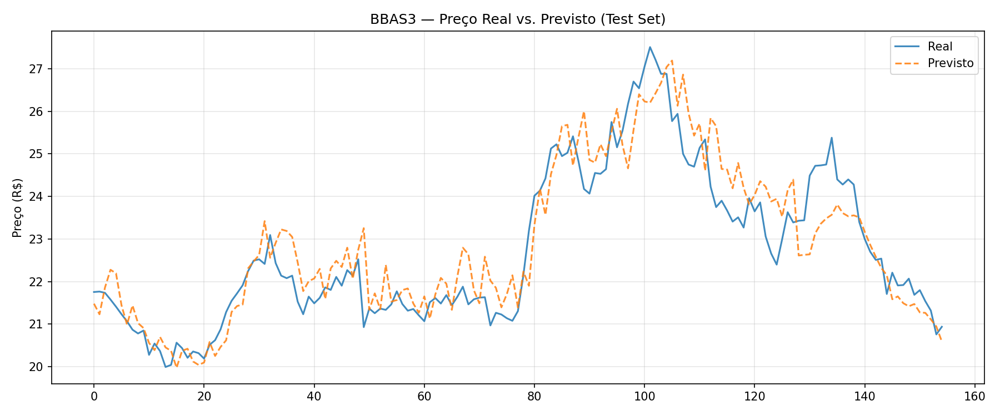

# BBAS3 LSTM Predictor

Modelo preditivo de preço de fecho para o ativo **BBAS3.SA** (Banco do Brasil) utilizando redes neurais LSTM, servido via API RESTful com FastAPI e deployado na Railway via Docker.

---

## Arquitetura

```
┌──────────────────────────────────────────────────────────────────────┐
│                         PIPELINE DE TREINO                           │
│                                                                      │
│  yfinance          Feature           PyTorch           Artefactos    │
│  BBAS3.SA  ──────► Engineering ────► LSTM Train ─────► model_best.pt │
│  ^BVSP             (15 features)     MPS / CPU         scaler.pkl    │
└──────────────────────────────────────────────────────────────────────┘
                                                              │
                                                              ▼
┌──────────────────────────────────────────────────────────────────────┐
│                           API (PRODUÇÃO)                             │
│                                                                      │
│  Request           Predictor          LSTM               Response    │
│  GET /predict ───► yfinance fetch ──► inference ────────► JSON       │
│                    + features         map_location=cpu   (preço R$)  │
│                    + normalize                                       │
│                                                                      │
│  Swagger UI disponível em /docs                                      │
└──────────────────────────────────────────────────────────────────────┘
```

### Modelo

- **Tipo:** LSTM (Long Short-Term Memory) — 2 camadas empilhadas
- **Input:** janela de **30 dias úteis × 15 features**
- **Output:** preço de fecho do próximo dia útil (single-step, R$)
- **Regularização:** Dropout (0.4) entre camadas
- **Loss:** HuberLoss(delta=0.1) | **Optimizer:** Adam com ReduceLROnPlateau

### Features (15 por timestep)

| # | Feature | Descrição |
|---|---|---|
| 1–5 | Open, High, Low, Close, Volume | OHLCV do BBAS3.SA |
| 6 | RSI(14) | Indicador de momentum |
| 7–9 | MACD Line, Signal, Histogram | Tendência e momentum cruzado |
| 10 | Bollinger Width | Volatilidade relativa |
| 11–12 | EMA(9), EMA(21) | Médias móveis exponenciais |
| 13 | Volume/SMA(20) | Ratio de volume vs. média |
| 14 | IBOV Close | Ibovespa (^BVSP) como dado exógeno |
| 15 | Close_pct | Variação percentual do fecho |

---

## Estrutura do Repositório

```
bbas3-lstm/
├── src/
│   ├── data/
│   │   ├── fetch.py          # Download BBAS3 + IBOV via yfinance
│   │   ├── features.py       # Cálculo dos 15 indicadores técnicos
│   │   └── dataset.py        # StockDataset + sliding window + scaler
│   ├── model/
│   │   ├── lstm.py           # Definição da rede (nn.Module)
│   │   └── train.py          # Loop de treino + ReduceLROnPlateau
│   └── evaluate.py           # MAE, RMSE, MAPE + gráfico de avaliação
│
├── api/
│   ├── main.py               # FastAPI app + endpoints + lifespan
│   ├── predictor.py          # Lógica de inferência em produção
│   └── schemas.py            # Pydantic request/response models
│
├── artifacts/                # Gerado pelo treino (não versionado)
│   ├── model_best.pt         # State dict com menor val_loss
│   ├── scaler.pkl            # MinMaxScaler serializado
│   └── evaluation_plot.png   # Gráfico real vs. previsto
│
├── data/raw/                 # CSVs baixados (não versionados)
├── train_pipeline.py         # Ponto de entrada do treino
├── Dockerfile                # Produção (linux/amd64, CPU torch)
├── Dockerfile.local          # Desenvolvimento local com reload
├── docker-compose.yml        # Stack local com volumes montados
└── Makefile                  # Automação de todos os comandos
```

---

## Fluxo de Dados

### Treino

```
fetch_and_align()
  └── yfinance.download(BBAS3.SA, ^BVSP, period=5y)
  └── inner join por data → DataFrame OHLCV + IBOV_Close
        │
        ▼
build_features()
  └── Calcula RSI, MACD, Bollinger, EMA, Volume_Ratio, Close_pct
  └── dropna() → remove primeiras ~26 linhas (MACD precisa de 26 períodos)
  └── DataFrame final: ~1220 linhas × 15 colunas
        │
        ▼
build_dataloaders()
  ├── Split cronológico: 70% treino | 15% val | 15% test
  ├── MinMaxScaler.fit() EXCLUSIVAMENTE no treino → sem data leakage
  ├── scaler serializado em artifacts/scaler.pkl
  └── StockDataset: sliding window de 30 dias
        X: (30, 15) → y: Close(t+1) normalizado
        │
        ▼
train() → 100 epochs, device=MPS (Apple M3)
  └── Guarda model_best.pt (menor val_loss) + model.pt (final)
        │
        ▼
evaluate() → métricas no test set em escala real (R$)
  └── MAE, RMSE, MAPE + gráfico salvo em artifacts/
```

### Inferência (API)

```
POST /predict?ticker=BBAS3
        │
        ▼
Predictor._build_input_window()
  ├── yfinance.download(BBAS3.SA + ^BVSP, period=60d)
  │   (60 dias garantem 30 válidos após cálculo de indicadores)
  ├── build_features() → mesma lógica do treino
  └── últimos 30 dias → shape (30, 15)
        │
        ▼
scaler.transform(window)          → normalizado
model(tensor.unsqueeze(0))        → output normalizado
inverse_transform_close(scaler)   → preço em R$
        │
        ▼
PredictionResponse { ticker, predicted_close, prediction_date, latency_ms }
```

---

## Como Executar Localmente

### Pré-requisitos

- Python 3.11+
- Docker (para execução via container)
- Make

### 1. Instalar dependências

```bash
make install
```

Cria `.venv/` e instala todas as dependências. No Mac M3, o PyTorch é instalado com suporte a **MPS** automaticamente.

### 2. Treinar o modelo

```bash
make train
```

Executa o pipeline completo: download dos dados, feature engineering, treino (100 epochs, device MPS), avaliação e exportação dos artefactos. Ao final, os ficheiros abaixo serão gerados:

```
artifacts/
├── model_best.pt       # Modelo com menor val_loss
├── scaler.pkl          # Scaler para normalização/desnormalização
└── evaluation_plot.png # Gráfico real vs. previsto no test set
```

### 3. Executar a API localmente

```bash
make run
```

API disponível em `http://localhost:8000`.  
Swagger UI disponível em `http://localhost:8000/docs`.

**Exemplo de chamada:**

```bash
curl -X POST "http://localhost:8000/predict?ticker=BBAS3"
```

**Resposta:**
```json
{
  "ticker": "BBAS3",
  "predicted_close": 27.43,
  "prediction_date": "2026-05-15",
  "model_version": "1.0.0",
  "latency_ms": 312.5
}
```

### 4. Executar via Docker (local)

```bash
# Build da imagem de desenvolvimento
make build-local

# Inicia com docker-compose (volumes montados, reload ativo)
make run-local
```

---

## Documentação da API

| Ambiente | URL |
|---|---|
| Local | http://localhost:8000/docs |
| Produção | `https://<seu-projeto>.railway.app/docs` |

### Endpoints

| Método | Path | Descrição |
|---|---|---|
| `POST` | `/predict` | Prevê o preço de fecho do próximo dia útil |
| `GET` | `/health` | Estado da API e confirmação de modelo carregado |
| `GET` | `/metrics` | Contadores de predições e latência (p95) |

---

## Fine-Tuning do Modelo

O processo de optimização do modelo foi documentado em detalhe, cobrindo 6 iterações de treino com diferentes configurações de hiperparâmetros.

📄 **[docs/FINE_TUNING.md](docs/FINE_TUNING.md)**

| Métrica | Baseline (Run 1) | Melhor (Run 6) |
|---------|-----------------|----------------|
| MAPE | 4.80% | **2.56%** |
| MAE | R$ 1.1098 | **R$ 0.5907** |
| RMSE | R$ 1.5776 | **R$ 0.7542** |

As principais decisões que levaram ao melhor resultado:
- Substituição de `MSELoss` por `HuberLoss(delta=0.1)` — mais robusto a spikes políticos
- Dropout elevado para **0.4** — previne memorização de padrões não generalizáveis
- Adição de `Close_pct` como 15ª feature — sinal direcional explícito
- `ReduceLROnPlateau(factor=0.7, min_lr=1e-4)` — decaimento mais gradual do LR
- Early stopping com `patience=100` — evita epochs desperdiçadas após convergência

### Preço Real vs. Previsto — Test Set (Run 6)



---

## Referência dos Comandos Make

| Comando | Descrição |
|---|---|
| `make install` | Cria venv e instala dependências com torch MPS |
| `make train` | Executa o pipeline completo de treino |
| `make run` | Inicia a API FastAPI com hot-reload |
| `make build` | Build da imagem Docker de produção (linux/amd64) |
| `make run-docker` | Executa a imagem de produção localmente |
| `make build-local` | Build da imagem Docker de desenvolvimento |
| `make run-local` | Inicia a stack local via docker-compose |
| `make clean` | Remove artefactos gerados pelo treino |
